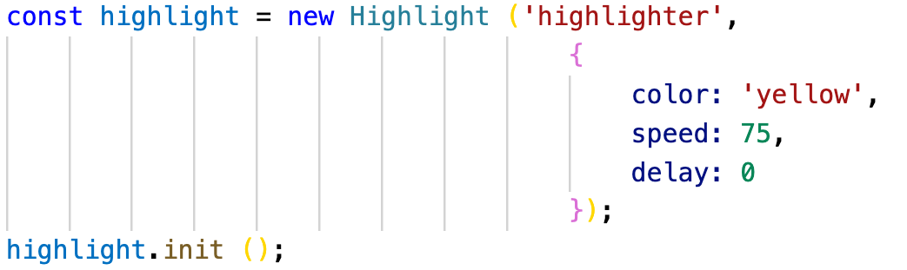
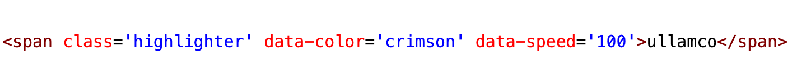

This library creates a dynamic highlighter. You can specify color, speed, and delay of the highlight.

Download the dist folder if you wish to use this library without any further modifications. The dist folder contains minified babel code.

If you wish to modify the default settings, simply follow these steps:

git clone git@github.com:jawadshuaib/dynamic-highlighter.git

> npm install

You can modify the settings in the src/index.js file:

You can also modify the color and speed of the highlighter by changing the data attribute on the element:

That's all :)
